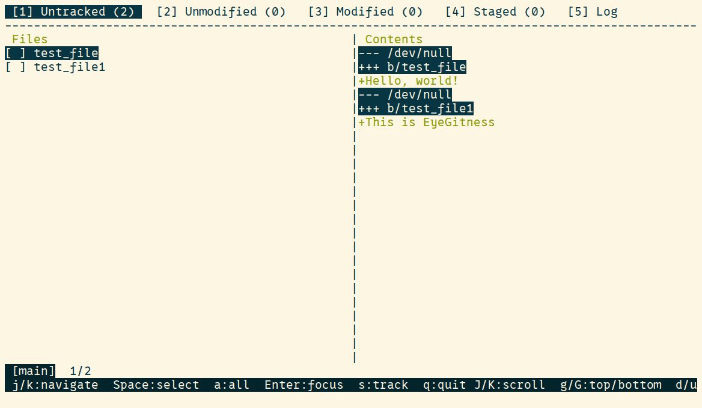

# EyeGitness

A keyboard-driven Git TUI for managing your git repos.

## Overview

EyeGitness is a terminal user interface for Git that replaces the repetitive cycle of `git status`, `git diff`, and `git add` with a single interactive workspace. It presents untracked, modified, staged, and unmodified files across tabbed views, each with inline diff visualization and keyboard-driven file selection.

The tool targets developers who prefer the terminal but want faster feedback loops than raw Git commands provide — without adopting a full GUI client.

## Features

- **Tabbed file views** — Switch between Untracked, Unmodified, Modified, Staged, and Log tabs with number keys.
- **Interactive staging and unstaging** — Select files individually or in bulk, then stage or unstage with a single keystroke.
- **Inline diff visualization** — Color-coded diffs rendered alongside the file list with additions, deletions, and hunk headers clearly distinguished.
- **Commit creation** — Open a modal commit dialog directly from the staged tab; compose multiline messages without leaving the interface.
- **Commit log with graph** — View decorated commit history with branch graph, tags, and HEAD indicators.
- **Vim-style navigation** — `j`/`k` for file list movement, `J`/`K` for diff scrolling, `d`/`u` for half-page jumps, `g`/`G` to jump to top or bottom.
- **Horizontal scrolling** — Navigate wide diffs with `H`/`L`.
- **Status bar** — Displays current branch, cursor position, selected file count, and ahead/behind upstream counts.

## Demo

<!-- Replace with a GIF or screenshot of the interface -->


<!-- Optional: static screenshots of individual views -->
<!--  -->
<!--  -->
<!--  -->

## Installation

Requires Python 3.12+ and Git.

```bash
# Clone the repository
git clone https://github.com/yourusername/eyegitness.git
cd eyegitness

# Create a virtual environment and install
python -m venv .venv
source .venv/bin/activate
pip install .
```

After installation, the `eyegitness` command is available on your `PATH`.

Alternatively, run directly from source:

```bash
pip install prompt_toolkit
python src/main.py
```

## Usage

Run EyeGitness from within any Git repository:

```bash
cd /path/to/your/repo
eyegitness
```

### Key Bindings

| Key | Action |
|-----|--------|
| `1`–`5` | Switch tabs (Untracked, Unmodified, Modified, Staged, Log) |
| `j` / `k` | Move cursor through file list |
| `Space` | Toggle file selection |
| `a` | Select / deselect all files |
| `Enter` | Focus a single file in the diff pane |
| `s` | Stage selected files (or open commit dialog from Staged tab) |
| `S` | Unstage selected files |
| `J` / `K` | Scroll diff view by line |
| `d` / `u` | Scroll diff view by half-page |
| `g` / `G` | Jump to top / bottom of diff |
| `H` / `L` | Scroll diff horizontally |
| `Alt+Enter` | Submit commit message |
| `Esc` | Cancel commit dialog |
| `q` | Quit |

## Technical Details

### Architecture

EyeGitness follows a clear separation of concerns across five modules:

```
src/
├── main.py              # Application entry point and event loop
├── state.py             # Centralized application state
├── ansi/                # ANSI escape code handling and diff colorization
├── git/                 # Git subprocess wrappers (status, diff, log)
├── keybinds/            # Input handling and key binding definitions
└── views/               # UI components (layout, tabs, file list, diff, log, status bar, commit dialog)
```

### TUI Framework

The interface is built with [prompt_toolkit](https://github.com/prompt-toolkit/python-prompt-toolkit), using its layout engine (`HSplit`, `VSplit`, `FloatContainer`) for pane arrangement and `FormattedTextControl` for rendering ANSI-formatted content. A `FloatContainer` provides the modal commit dialog overlay. The application refreshes on a 0.5-second interval to reflect external file system changes.

### Git Integration

All Git operations are executed through `subprocess.run` calls to the `git` CLI. This avoids library abstractions and gives direct access to Git's output formats — particularly useful for parsing colored diffs and decorated log graphs. Operations include status queries, staging/unstaging, intent-to-add for untracked files, commit creation, and log retrieval.

### Rendering

Views are functional: each render cycle recomputes the display from current state. Diff output is colorized through a custom ANSI colorizer that handles addition/deletion highlighting, hunk headers, and file headers. An ANSI-aware text slicer ensures horizontal scrolling works correctly with escape sequences.

## Design Considerations

- **Subprocess over GitPython** — Direct `git` CLI calls eliminate a dependency and produce output identical to what developers already expect. Parsing raw output is straightforward for the operations EyeGitness supports.
- **prompt_toolkit over curses** — prompt_toolkit provides a higher-level layout system, built-in Unicode and wide-character support (via `wcwidth`), and cross-platform terminal handling without the boilerplate of raw curses.
- **Centralized state** — A single `AppState` object manages cursor position, selections, scroll offsets, and tab state. This simplifies reasoning about UI behavior and prevents state desynchronization across views.
- **Periodic refresh** — A 0.5-second refresh interval picks up external changes (e.g., file edits in another terminal) without manual reload, while keeping CPU usage negligible.
- **Functional rendering** — Recomputing views from state on each cycle avoids stale UI bugs at the cost of minimal overhead — acceptable given the small data sizes typical of Git status output.

## Future Improvements

- Branch management (create, switch, delete, merge)
- Merge conflict resolution with side-by-side diff view
- Stash support (stash, pop, list, apply)
- File-level patch staging (hunk-by-hunk selection)
- Configurable key bindings
- Search and filtering within file lists and diffs
- Remote operations (fetch, pull, push) with progress display
- Blame view with commit attribution

## Skills Demonstrated

- **Python development** — Modular architecture, type annotations, and clean separation of concerns.
- **TUI/CLI design** — Full-screen terminal application with paned layouts, modal dialogs, and keyboard-driven interaction.
- **Git internals** — Direct integration with Git's CLI, parsing of status, diff, and log output formats.
- **Software architecture** — Centralized state management, functional rendering, and a modular view system.
- **UX for developer tools** — Vim-style keybindings, contextual status hints, and a workflow designed around real Git usage patterns.

## License

This project is licensed under the [MIT License](LICENSE).
